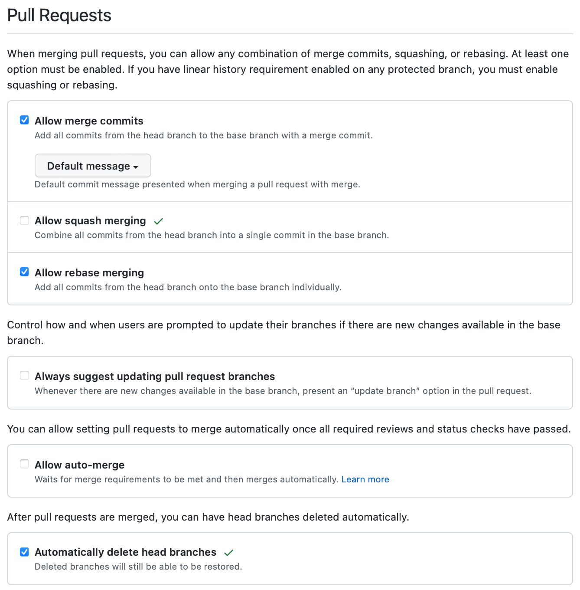
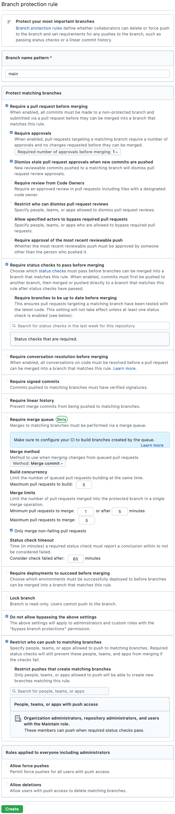
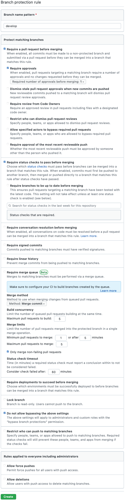
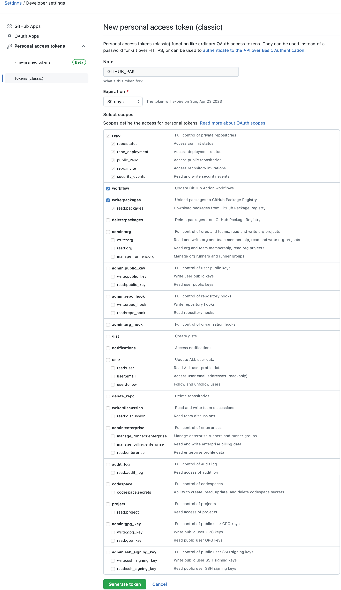

# HyP3 Cookiecutter

Use [Cookiecutter](https://cookiecutter.readthedocs.io/en/latest/) to quickly 
generate a new HyP3 Plugin.

## Usage

### 1. Create the plugin with Cookiecutter

To create a new plugin, you'll first need to run the cookicutter.
From a terminal on your local development machine, navigate to where you'd like 
to create the local copy of the plugin's repository. Then run cookiecutter and 
follow the prompts:

```bash
python3 -m pip install cookiecutter
cookiecutter https://github.com/ASFHyP3/hyp3-cookiecutter.git
```

Now, you should have a `hyp3-<process>` directory which contains a minimal HyP3
plugin.

### 2. Create a repository on GitHub

Next, we'll need to create a new repository on [GitHub](https://github.com) for your plugin.
Make sure to create your repository in the same user/organization account you set in the
`<GITHUB_USERNAME>` field of the cookiecutter.

You repository name should be the same as the directory name for the plugin you created
on your local develop machine. (e.g., `hyp3-<PROCESS_TYPE>`). For the description section,
you can copy in the short description you created in the cookiecutter step. You can find this
in your newly-generated, `README.md` file, or in your command line history. Next, set the 
repository to "Public", and *do not* click the "Initialize repository with a
README" box (or add a `.gitignore` or add a license). 

### 3. Setup a development environment

We use a `conda`/`mamba` environments to manage our dependencies; you can get Mambaforge
(recommended) here:

https://github.com/conda-forge/miniforge#mambaforge

And you can get Miniconda here:

https://docs.conda.io/en/latest/miniconda.html

Once conda is installed, from the repository root, you can create and activate a
development environment with all the necessary dependencies

```bash
cd hyp3-<process>
conda env create -f environment.yml
conda activate hyp3-<process>
``` 

You should now have a development environment with all the required packages for
a generic HyP3 plugin. Later, as dependencies change, you can edit the `environment.yml`
file and then update your environment with

```bash
conda env update -f environment.yml
```

### 4. Push the repository to GitHub

We want to push the local copy we just created to our GitHub repository:

```bash
# From hyp3-<process>
git init .
git remote add origin https://github.com/<GITHUB_USERNAME>/hyp3-<PROCESS_TYPE>.git
git add .
git commit -m "Minimal HyP3 plugin created with the hyp3 plugin cookiecutter"
git branch -M main
git push -u origin main
```

We also want to create a zeroth production version from this initial commit so that
the plugin's auto-versioning will work correctly.

```bash
git tag -a v0.0.0 -m "Marking zeroth release for auto-versioning and CI/CD Tooling"
git push --tags
```

Then add a development branch:

```bash
git checkout -b develop
git push -u origin develop
```

### 5. Configure the GitHub repository settings

Once the zeroth release is pushed to GitHub, we need to configure the GitHub repository settings.
The settings detailed here are not required, but we **STRONGLY** recommend them as they make it much
 easier for others to collaborate on your project, and for you to control how the collaboration
occurs.

Go to your repository in GitHub and on the right, click "Settings", then:
1. In main page:
   * In the "Pull Requests" section
     * un-click "Allow squash merging"
     * Make sure "Automatically delete head branches" is clicked
     * See [Pull Request section screenshot](#pr-rules) for configuration image
2. In "Branches":
   * make sure the default branch is "develop"
   * Add a "Branch protection rule" for:
     * main:
       * set "Branch name pattern" to "main"
       * click "Require pull request review before merging"
       * click "Dismiss stale pull request approvals when new commits are pushed"
       * click "Require status checks to pass before merging"
       * click "Do not allow bypassing of the above settings"
       * click "Restrict who can push to matching branches"
       * Create
       * See [Main branch rules section screenshot](#main-branch-rules) for configuration image
     * develop:
       * set "Branch name pattern" to "develop"
       * click "Require pull request review before merging"
       * click "Require status checks to pass before merging"
       * click "Do not allow bypassing of the above settings"
       * Create
       * See [Develop branch rules section screenshot](#develop-branch-rules) for configuration image

For both the `main` and `develop` you can restrict who can push to the branch.
In the same page where you set the above options, you can also click "Restrict
who can push to matching branches", then search and add the desired people/organizations
who are allowed to push. If you set this, make sure you include the owner of your
repository in this list - other your GitHub Actions won't work!

For more information on how to contribute to repositories set up in this manner,
check out GitHub's [GitHub flow](https://docs.github.com/en/get-started/quickstart/github-flow)
article

### 6. Create a personal access key for GitHub Actions

Some of the GitHub actions (`release.yml` and `tag-version.yml` need extra permissions to work
properly. These actions will attempt to use the `GITHUB_PAK` secret to assume a user profile
with the needed permissions and we'll need to create these permissions/secret.

1. In your user/organization settings:
    * Click on Developer Settings
    * Click on Personal access tokens
    * Click Tokens (classic)
    * Click Generate new token
    * Click Generate new token (classic)
    * In the note section give the token a name (e.g., `GITHUB_PAK`)
    * Check the boxes for:
        * repo
        * workflow
        * write:packages
        * See [GITHUB_PAK permissions section screenshot](#GITHU_PAK-permissions) for configuration image
    * Click Generate token
    * Copy your access token and save it for the next step
2. In your HyP3 plugin repository:
    * Click on Settings
    * Click on Secrets and variables
    * Click on Actions
    * Click on New repository Secret
    * Name your secret `GITHUB_PAK`
    * Paste in the access token you save from the last step
    * Click Add secret

This access token will regularly expire unless you set them to last forever (which we don't recommend)
so make sure to keep the token current and the secret up to date!

### 7. Restart the GitHub Actions

Now you're all setup! You should be able to navigate to your repository "Actions",
restart the failed Workflows on `develop`, and watch it create minimal HyP3 plugin 
container for your process.

### 8. Make HyP3 plugin container public

Once the Actions have successfully run, a containerized version of your plugin will be
available in the GitHub Container Registry (GHCR). You can find this plugin in the "Packages"
section of your GitHub user/organization account. You can also `pull` it to your local
machine for use using the command:

`docker pull ghcr.io/<GH_ACCOUNT_NAME>/<GH_REPOSITORY_NAME>`

GHCR containers are private by default. You'll need to manually change the visibility of
your container to "Public" so that HyP3 can access it. See this [GitHub Documentation](https://docs.github.com/en/packages/learn-github-packages/configuring-a-packages-access-control-and-visibility#configuring-visibility-of-packages-for-your-personal-account)
for a step-by-step guide.

## Screenshots

### PR Rules


### Main Branch Rules


### Develop Branch Rules


### GITHUB_PAK Permissions



